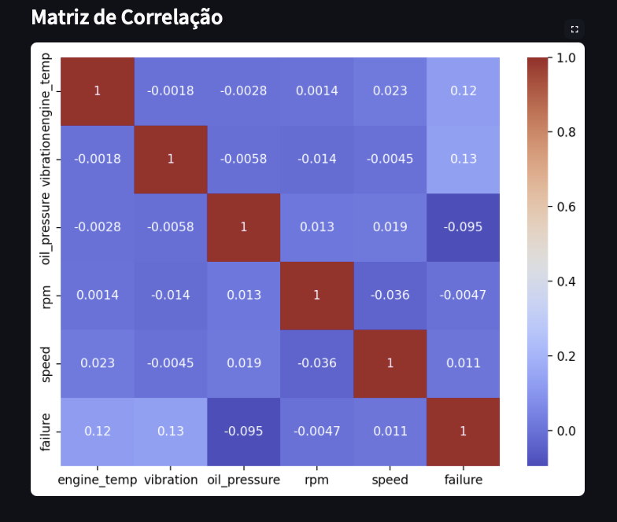

# Vehicle Health Monitor & Fault Predictor 🚗🛠️

Este projeto foi desenvolvido como parte do Capstone da University of Europe, com o objetivo de simular um sistema inteligente de monitoramento de saúde veicular e predição de falhas com base em dados de sensores.

---

## 🧠 Objetivo

Criar um sistema que:

- Analise dados de sensores de um veículo (temperatura do motor, vibração, pressão do óleo, etc.)
- Detecte padrões anômalos associados a falhas
- Faça previsões antecipadas com uso de modelos de Machine Learning
- Visualize os resultados de forma interativa via dashboard (Streamlit)

---

## 📁 Estrutura do Projeto

> 🔄 O projeto é composto por 4 notebooks e 1 script `.py`:
> - Os notebooks cobrem desde a geração dos dados até a modelagem e avaliação.
> - O script Python final (`Capstone_05_Dashboard_Streamlit.py`) implementa o dashboard interativo com Streamlit.


```
Capstone_VehicleHealth/
│
├── data/                      # Dataset simulado
│   └── vehicle_sensor_data.csv
│
├── notebooks/                 # Notebooks organizados por etapa
│   ├── Capstone_01_Simulated_Dataset.ipynb
│   ├── Capstone_02_ETL_and_EDA.ipynb
│   ├── Capstone_03_Machine_Learning.ipynb
│   └── Capstone_04_Reporting_Results.ipynb
│
├── dashboard/                 # Dashboard interativo em Streamlit
│   └── Capstone_05_Dashboard_Streamlit.py
│
├── assets/                    # Recursos visuais
│   └── imgs/                  # (imagens futuras, logos, gráficos, etc.)
│
├── requirements.txt           # Bibliotecas e dependências
└── README.md                  # Este arquivo
```
---

## ✅ Tecnologias Utilizadas

- Python 3
- pandas, NumPy, scikit-learn
- matplotlib, seaborn, plotly
- Streamlit

---

## 📊 Resultado

O sistema desenvolvido permite monitorar o estado de um veículo em tempo real e prever possíveis falhas com antecedência, aumentando a confiabilidade e a segurança do veículo.

## 📈 Resultados Visuais

Abaixo estão alguns exemplos de saída do dashboard desenvolvido com Streamlit:

### 📊 Estatísticas Gerais
<p align="center">
  
</p>

### 📉 Distribuições
<p align="center">
  
</p>

### 🔗 Matriz de Correlação
<p align="center">
  
</p>

🗂️ Veja também: 📄 [Resultados do Dashboard (PDF)](assets/dashboard_resultados.pdf)


<p align="center">
  <a href="https://capstonevehiclehealth.streamlit.app">
    
  </a>
</p>


## 🚀 Como Rodar o Projeto

1. Clone este repositório  
2. Instale as dependências com:  
pip install -r requirements.txt

3. Execute o dashboard com:  
streamlit run dashboard/Capstone_05_Dashboard_Streamlit.py

---

## 📌 Observação

Este projeto utiliza dados simulados com base em padrões realistas para fins acadêmicos e demonstrativos.

---


