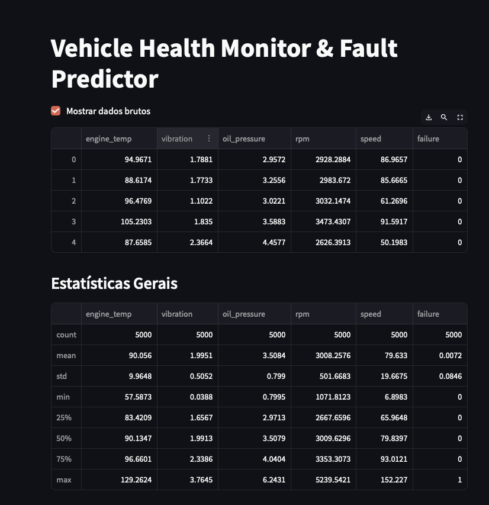
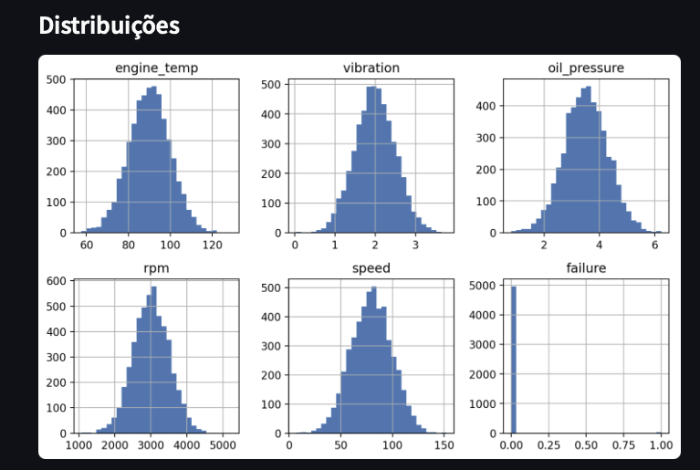

# Vehicle Health Monitor & Fault Predictor 🚗🛠️

This project was developed as part of the Capstone for the Master's in Software Engineering at the University of Europe. The goal was to simulate an intelligent vehicle health monitoring system that can predict failures using sensor data and machine learning.

---

## 🧠 Objective

Develop a system capable of:

- Analyzing sensor data from vehicles (e.g., engine temperature, vibration, oil pressure, RPM, speed)
- Detecting abnormal patterns related to failures
- Predicting failures in advance using Machine Learning (Random Forest)
- Displaying the results interactively through a dashboard built with Streamlit

---

## 🗂️ Project Structure

The project is structured into 4 notebooks and 1 dashboard script:

- The notebooks cover data generation, ETL, modeling and evaluation.
- The final Python script (`Capstone_05_Dashboard_Streamlit.py`) implements the interactive dashboard with Streamlit.

```
Capstone_VehicleHealth/
├── data/                            # Simulated dataset
│   └── vehicle_sensor_data.csv
├── notebooks/                       # Notebooks organized by stage
│   ├── Capstone_01_Simulated_Dataset.ipynb
│   ├── Capstone_02_ETL_and_EDA.ipynb
│   ├── Capstone_03_Machine_Learning.ipynb
│   └── Capstone_04_Reporting_Results.ipynb
├── dashboard/                       # Interactive dashboard
│   └── Capstone_05_Dashboard_Streamlit.py
├── assets/                          # Visual resources
│   └── imgs/                        # (future images, logos, plots, etc.)
├── requirements.txt                # Python dependencies
└── README.md                       # This file
```

---

## 📂 Quick Access to Notebooks

- [Simulated Dataset](notebooks/Capstone_01_Simulated_Dataset.ipynb)
- [ETL and EDA](notebooks/Capstone_02_ETL_and_EDA.ipynb)
- [Machine Learning](notebooks/Capstone_03_Machine_Learning.ipynb)
- [Reporting Results](notebooks/Capstone_04_Reporting_Results.ipynb)
- [Streamlit Dashboard](dashboard/Capstone_05_Dashboard_Streamlit.py)

---

## 📊 Dataset Description

The dataset `vehicle_sensor_data.csv` contains the following simulated features:

| Feature         | Description                           |
|-----------------|---------------------------------------|
| `engine_temp`   | Engine temperature (°C)               |
| `vibration`     | Vibration intensity (g)               |
| `oil_pressure`  | Oil pressure (bar)                    |
| `rpm`           | Revolutions per minute                |
| `speed`         | Vehicle speed (km/h)                  |
| `failure`       | Binary target: 1 = failure, 0 = normal|

---

## 🧪 Results

The developed system allows monitoring a vehicle’s condition in real-time and predicting potential failures in advance — increasing reliability and vehicle safety.

---

## 📈 Visual Results

### 📊 General Statistics
*(Streamlit dashboard preview)*



### 📊 Distributions



### 📊 Correlation Matrix


---

## 🌐 Dashboard Preview

- [🟢 Streamlit App (Live Demo)](https://link-to-your-deployed-app)
- [📄 Dashboard Report (PDF)](https://link-to-your-pdf)

---

## 🧠 Key Results

- Accuracy: **99.9%**
- Precision & Recall: **1.00** for 'Normal', **0.86** for 'Failure'
- Only **1 false negative** in the test set
- Highly imbalanced data handled using `class_weight='balanced'` in the model

---

## 🔮 Future Improvements

- Experiment with additional ML models (e.g., XGBoost, SVM)
- Include real-world sensor datasets (e.g., from UCI or Kaggle)
- Add time-series analysis for failure prediction
- Improve dashboard interactivity with Streamlit widgets
- Expand deployment options (e.g., Docker, cloud API)

---

## 🚀 How to Run the Project

1. Clone this repository:
```bash
git clone https://github.com/tiagorcfortunato/Capstone_VehicleHealth.git
cd Capstone_VehicleHealth
```

2. Install dependencies:
```bash
pip install -r requirements.txt
```

3. Run the notebooks step-by-step (data, ETL, ML, reporting)

4. Launch the dashboard:
```bash
streamlit run dashboard/Capstone_05_Dashboard_Streamlit.py
```

---

## 🛠️ Technologies Used

- Python (Pandas, NumPy, Scikit-learn)
- Seaborn, Matplotlib
- Streamlit (dashboard)
- Git & GitHub

---

## 👨‍💻 Author

**Tiago Fortunato**  
Software Engineering Student | Mechanical Engineer

- 🔗 [LinkedIn](https://www.linkedin.com/in/tiagorcfortunato)  
- 🔗 [GitHub](https://github.com/tiagorcfortunato)
